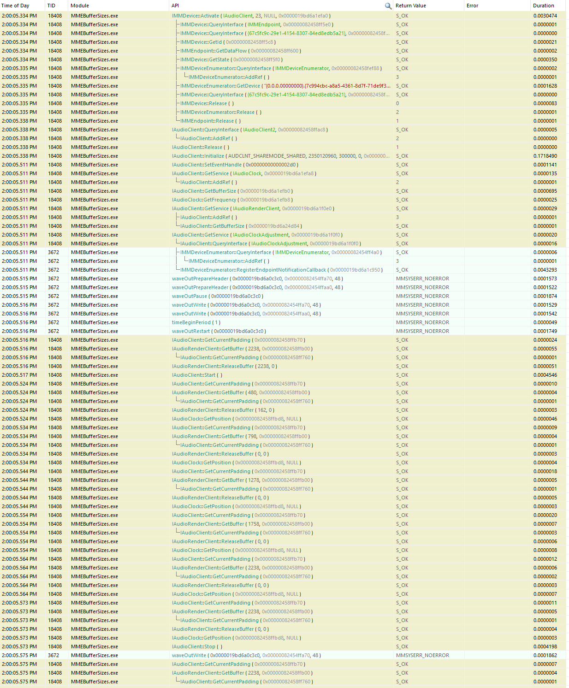

# MMEBufferSizes

A trivial C program for minimally reproducing glitching issues that occur when
playing audio using the Microsoft [MME][] API (a.k.a "Waveform-Audio Interface",
a.k.a "waveOut") on Windows using small buffer sizes.

This code can also serve as a minimal example of how to use MME to stream audio,
although it is not a very good one because it uses polling (which is
inefficient) for simplicity.

## The problem

MME is unable to play audio without glitches (a.k.a discontinuities, pops) when
the total MME buffer size is less than ~50-100 ms (the specific threshold seems
to depend on the audio device).

This behaviour is unexpected because it occurs even if no buffer underrun occurs
on the application side, i.e. there is always at least one buffer queued at any
given time.

There is no apparent technical reason why MME shouldn't work with such buffer
sizes. The Windows audio engine operates with a 10 ms periodicity, so these
buffer sizes are not "small" as far as the system is concerned. MME should be
able to handle this task just fine, but in practice it doesn't.

This is reproducible on Windows 11 22H2 22621.1413 (at least) with a variety of
audio devices.

[Windows Feedback Hub entry](https://aka.ms/AAk0ka3)

## Steps to reproduce

1. Build the code using Visual Studio, or fetch the [pre-built binary][].
2. Run `MMEBufferSizes.exe 0.050`.
   - This will play a sine wave using two MME buffers of 25 ms each.
3. Observe that the resulting audio is glitchy.

The glitches will disappear when running with `0.100` (two buffers of 50 ms
each) or larger.

Other parameters (e.g. buffer count, sample rate) can be adjusted by changing
the relevant constants in the code.

## Investigation

Example output:

```
Playing a 134.0 Hz sine wave at a 48000 Hz sample rate for 1.000 seconds using 2 buffers of 1200 frames, polling every 1 milliseconds
[0.000] Started
[0.000] 0:PQd 1:PQd
[0.002] 0:PQd 1:PQd
…
[0.057] 0:PQd 1:PQd
[0.058] 0:PqD 1:PqD
-> waveOutWrite(0)
[0.061] 0:PQd 1:PqD
-> waveOutWrite(1)
[0.063] 0:PQd 1:PQd
[0.065] 0:PQd 1:PQd
…
[0.117] 0:PQd 1:PQd
[0.119] 0:PqD 1:PqD
-> waveOutWrite(0)
[0.119] 0:PQd 1:PqD
-> waveOutWrite(1)
[0.120] 0:PQd 1:PQd
[0.122] 0:PQd 1:PQd
…
[0.174] 0:PQd 1:PQd
[0.176] 0:PQd 1:PQd
[0.178] 0:PQd 1:PqD
[0.179] 0:PqD 1:PqD
-> waveOutWrite(0)
[0.180] 0:PQd 1:PqD
-> waveOutWrite(1)
[0.181] 0:PQd 1:PQd
[0.182] 0:PQd 1:PQd
[0.185] 0:PQd 1:PQd
…
[0.235] 0:PQd 1:PQd
[0.237] 0:PQd 1:PQd
[0.239] 0:PqD 1:PqD
-> waveOutWrite(0)
[0.240] 0:PQd 1:PqD
-> waveOutWrite(1)
[0.240] 0:PQd 1:PQd
[0.242] 0:PQd 1:PQd
[0.244] 0:PQd 1:PQd
…
[0.295] 0:PQd 1:PQd
[0.297] 0:PQd 1:PQd
[0.298] 0:PqD 1:PqD
-> waveOutWrite(0)
[0.299] 0:PQd 1:PqD
-> waveOutWrite(1)
[0.300] 0:PQd 1:PQd
[0.301] 0:PQd 1:PQd
[0.303] 0:PQd 1:PQd
…
[0.355] 0:PQd 1:PQd
[0.357] 0:PQd 1:PQd
[0.359] 0:PqD 1:PqD
-> waveOutWrite(0)
[0.359] 0:PQd 1:PqD
-> waveOutWrite(1)
[0.360] 0:PQd 1:PQd
[0.362] 0:PQd 1:PQd
[0.363] 0:PQd 1:PQd
…
```

The above makes it clear that MME fails to mark buffers "done" in time (e.g.
the first buffer should have been done at T=25ms but instead only shows as done
at T=58ms) resulting in erratic timing.

### Reverse engineering MME internals

Running the program under [API Monitor][] reveals how MME uses [WASAPI][]
internally:



Close examination reveals that MME does check the state of the WASAPI-side
buffer every 10 ms. However, MME fails to mark the application-side buffer as
done when the amount of [padding] dips below 25 ms. Instead, MME lets the WASAPI
buffer run out of data, thereby causing an underrun on the WASAPI side. This
behaviour is incomprehensible and is likely an MME bug.

[MME]: https://learn.microsoft.com/en-us/windows/win32/multimedia/waveform-audio-interface
[pre-built binary]: https://github.com/dechamps/MMEBufferSizes/releases
[API Monitor]: http://www.rohitab.com/apimonitor
[WASAPI]: https://learn.microsoft.com/en-us/windows/win32/coreaudio/wasapi
[padding]: https://learn.microsoft.com/en-us/windows/win32/api/audioclient/nf-audioclient-iaudioclient-getcurrentpadding
